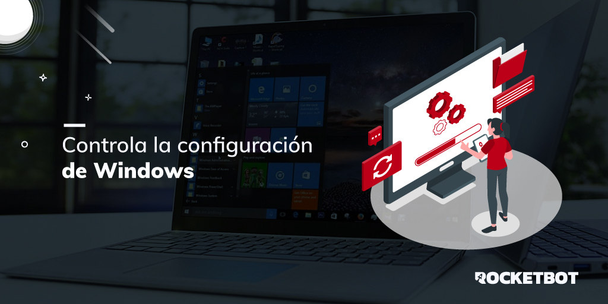

# Windows
  
Módulo para trabajar con la configuración de Windows  

*Read this in other languages: [English](Manual_Windows.md), [Português](Manual_Windows.pr.md), [Español](Manual_Windows.es.md)*
  

## Como instalar este módulo
  
Para instalar el módulo en Rocketbot Studio, se puede hacer de dos formas:
1. Manual: __Descargar__ el archivo .zip y descomprimirlo en la carpeta modules. El nombre de la carpeta debe ser el mismo al del módulo y dentro debe tener los siguientes archivos y carpetas: \__init__.py, package.json, docs, example y libs. Si tiene abierta la aplicación, refresca el navegador para poder utilizar el nuevo modulo.
2. Automática: Al ingresar a Rocketbot Studio sobre el margen derecho encontrara la sección de **Addons**, seleccionar **Install Mods**, buscar el modulo deseado y presionar install.  

## Descripción de los comandos

### Obtener resolución de pantalla
  
Retorna la resolución actual de la pantalla principal a una variable de Rocketbot
|Parámetros|Descripción|ejemplo|
| --- | --- | --- |
|Asignar resultado a variable|Variable donde se guardará el resultado|Variable|

### Obtener todas las resoluciones
  
Retorna todas las resoluciones de pantalla permitidas en la pantalla principal
|Parámetros|Descripción|ejemplo|
| --- | --- | --- |
|Asignar resultado a variable|Variable donde se guardará el resultado|Variable|

### Cambiar resolución
  
Modifica la resolución de la pantalla principal a la indicada. Debe ser una resolución permitida por el sistema
|Parámetros|Descripción|ejemplo|
| --- | --- | --- |
|Resolución|Resolución de pantalla (ancho,alto)|800,600|

### Obtener nombre de usuario
  
Devuelve el nombre del usuario actual
|Parámetros|Descripción|ejemplo|
| --- | --- | --- |
|Asignar resultado a variable|Variable donde se guardará el resultado|Variable|

### Bloquear pantalla 
  
Bloquea la pantalla de Windows
|Parámetros|Descripción|ejemplo|
| --- | --- | --- |

### Estoy logeado?
  
Verifica si el usuario actual esta logeado y no esta bloqueada la pantalla
|Parámetros|Descripción|ejemplo|
| --- | --- | --- |
|Asignar resultado a variable|Variable donde se guardará el resultado|Variable|

### Maximizar ventana
  
Maximiza una ventana por titulo
|Parámetros|Descripción|ejemplo|
| --- | --- | --- |
|Titulo|Titulo de la ventana a maximizar|Titulo de la ventana|

### Restaurar ventana
  
Restaura una ventana por titulo
|Parámetros|Descripción|ejemplo|
| --- | --- | --- |
|Titulo|Titulo de la ventana a restaurar|Titulo de la ventana|

### Minimizar ventana
  
Minimiza una ventana por título
|Parámetros|Descripción|ejemplo|
| --- | --- | --- |
|Titulo|Titulo de la ventana a minimizar|Titulo de la ventana|

### Listar ventanas abiertas
  
Lista las ventanas abiertas por título y handle si lo desea
|Parámetros|Descripción|ejemplo|
| --- | --- | --- |
|Guardar en|Variable donde se guardará el resultado|Variable|
|Desea los handles?|Marcar si se desea obtener los handles de las ventanas|False|
|Filtro|Palabra a buscar en el título de las ventanas|Palabra a buscar|

### Traer ventana al frente
  
Trae una ventana al frente
|Parámetros|Descripción|ejemplo|
| --- | --- | --- |
|Titulo|Titulo de la ventana a traer al frente|Titulo de la ventana|

### Buscar ventana
  
Busca una ventana por titulo
|Parámetros|Descripción|ejemplo|
| --- | --- | --- |
|Titulo|Titulo de la ventana a buscar|Titulo de la ventana|
|Guardar en|Variable donde se guardará el resultado|Variable|

### Obtener estado servicio
  
Obtener el estado de un servicio
|Parámetros|Descripción|ejemplo|
| --- | --- | --- |
|Title||Titulo del servicio|
|Asignar resultado a variable|Variable donde se guardará el resultado|Variable|

### Iniciar servicio
  
Inicia un servicio
|Parámetros|Descripción|ejemplo|
| --- | --- | --- |
|Title|Título del servicio a iniciar|Título del servicio|
|Asignar resultado a variable|Variable donde se guardará el resultado|Variable|

### Parar servicio
  
Para un servicio
|Parámetros|Descripción|ejemplo|
| --- | --- | --- |
|Title|Título del servicio a parar|Título del servicio|
|Asignar resultado a variable|Variable donde se guardará el resultado|Variable|

### Mover y redimensionar ventana
  
Cambia la posición y dimensiones de una ventana obtenida por título
|Parámetros|Descripción|ejemplo|
| --- | --- | --- |
|Title||Título|
|Coordenadas (x, y)|Coordenadas de la ventana en el escritorio|0,0|
|Dimensiones (Ancho, Alto)|Dimensiones de la ventana|0,0|
